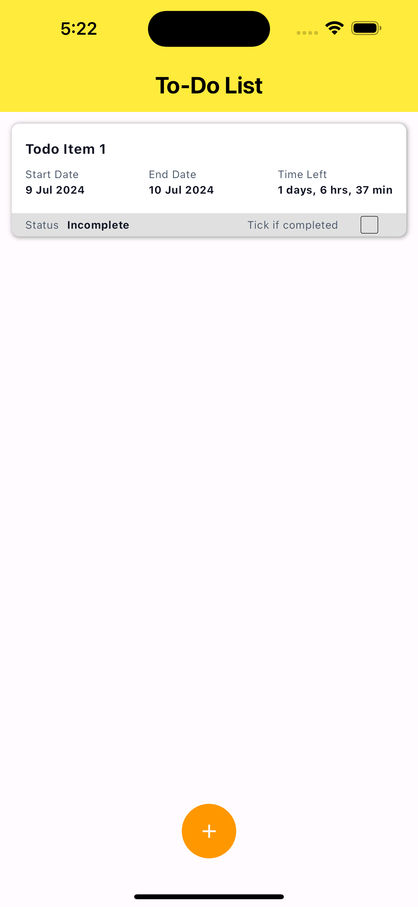
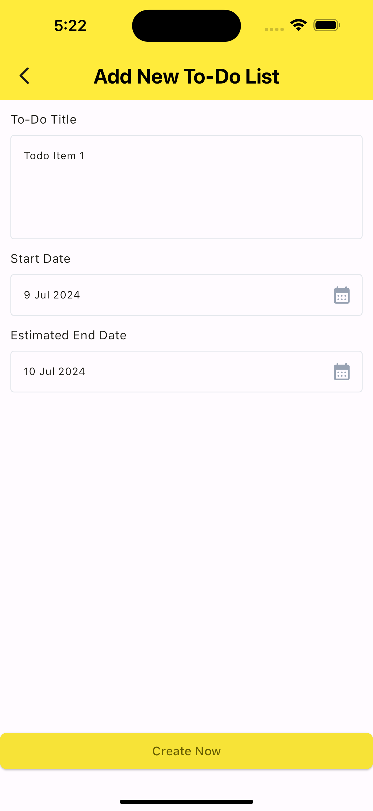
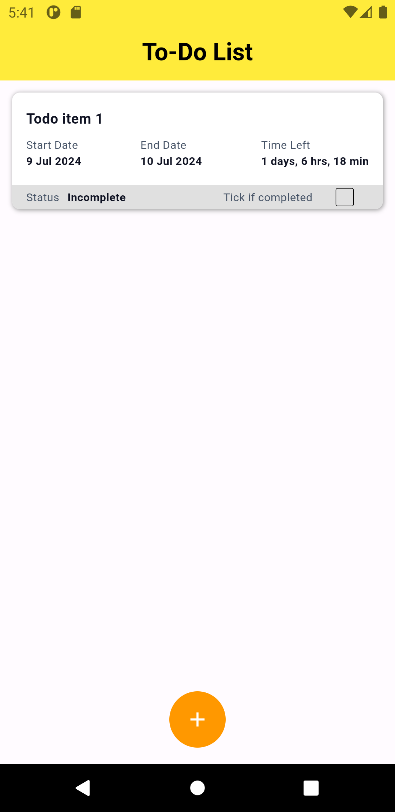
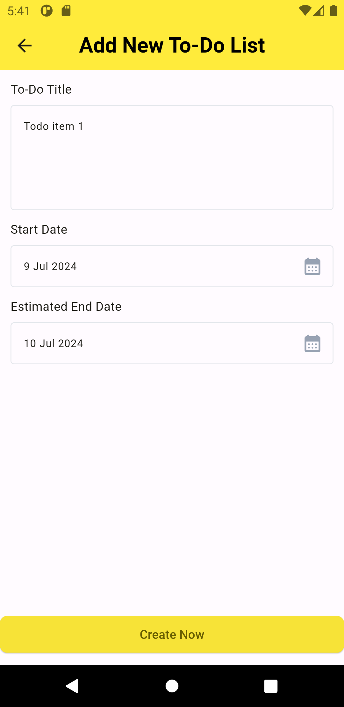

### A Simple TODO App

### How to start
1. Clone the repository to your local environment.
2. Run `flutter pub get` to install the dependencies.
3. Run the program.

##### Run the test
```shell
# Run all tests
$ flutter test

# Or you can run specific test by specifying the file name.
$ flutter test test/widget_test.dart
```

### Screenshots

#### IOS
 

#### Android
 